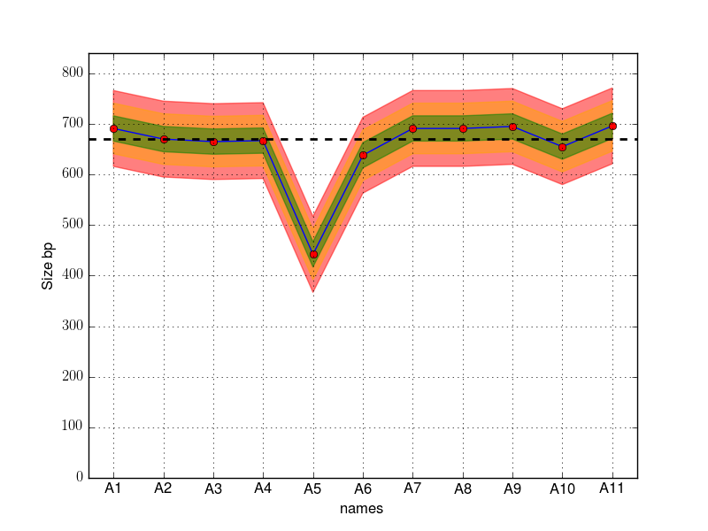

FragmentAnalyser utilities
===========================

Usage 
-------

Load the module
~~~~~~~~~~~~~~~~

On central-bio, edit your .profile and add this line::

    module use /pasteur/projets/Matrix/modules

When you open a new terminal, type those commands to load fragment_analyser 
in your environment::

    module load pyonbic
    module load fragment_analyser

Analyse some files
~~~~~~~~~~~~~~~~~~~~

Assuming you want to analyse a set of files starting with '2015' with csv 
extensions, type::

    fragment_analyser.py --pattern 2015*csv --create-images --output summary.csv

If you do not want to create images, add ::

    --no-images

Results are stored in **results.csv** file.

Input files must be CSV with the 12 samples. The number of files is not
important but should be 8 (8 lines on a plate ).

The tool fragmenet_analyser will identify the peak across the 12 samples that is
the most relevant. If a peak is found but clearly does not resemble the rest, it
will be set to NA (empty string). Once a peak is identified, we keep track of
its position (Size in base pair), concentration and a quantity refered to as nM.

Usage::

    python fragment_analyser --pattern files*csv --create-images
        --output results.csv

The file results.csv should contains 4 columns::

    names,ng/uL (QUBIT/FA),Taille (bp),nM
    WT1_1,4.0432,691.0,9.00189246354
    WT2_2,8.3981,670.0,19.2838117107
    WT3_3,6.2781,665.0,14.5242336611
    WT4_4,9.1844,667.0,21.1841771422
    WT5_5,,,
    WT6_6,9.9733,638.0,24.0494333253
    Delta1_7,18.0203,691.0,40.1208950239
    Delta2_8,21.1646,691.0,47.1214516309
    Delta3_9,23.714,695.0,52.4936358605
    Delta4_10,18.7718,655.0,44.0911332942
    Delta5_11,22.9869,696.0,50.8110079576
    Ladder,,,
    Delta Compl1_13,2.8591,691.0,6.36557942781
    Delta Compl2_14,3.6311,689.0,8.10784861003
    Delta Compl3_15,4.022,690.0,8.96767001115
    Delta Compl4_16,7.3515,701.0,16.1340941512

The 12th well (Ladder) is always empty.

The columns are:

names: name of the well
ng/ul: concentration in ng/uL
Size (bp): the length in base pair
nM: the concentration in nM unit. conc * 1000 / ((Size) * 650 /1000) where 650
    is a hard coded value (mw_dna)

