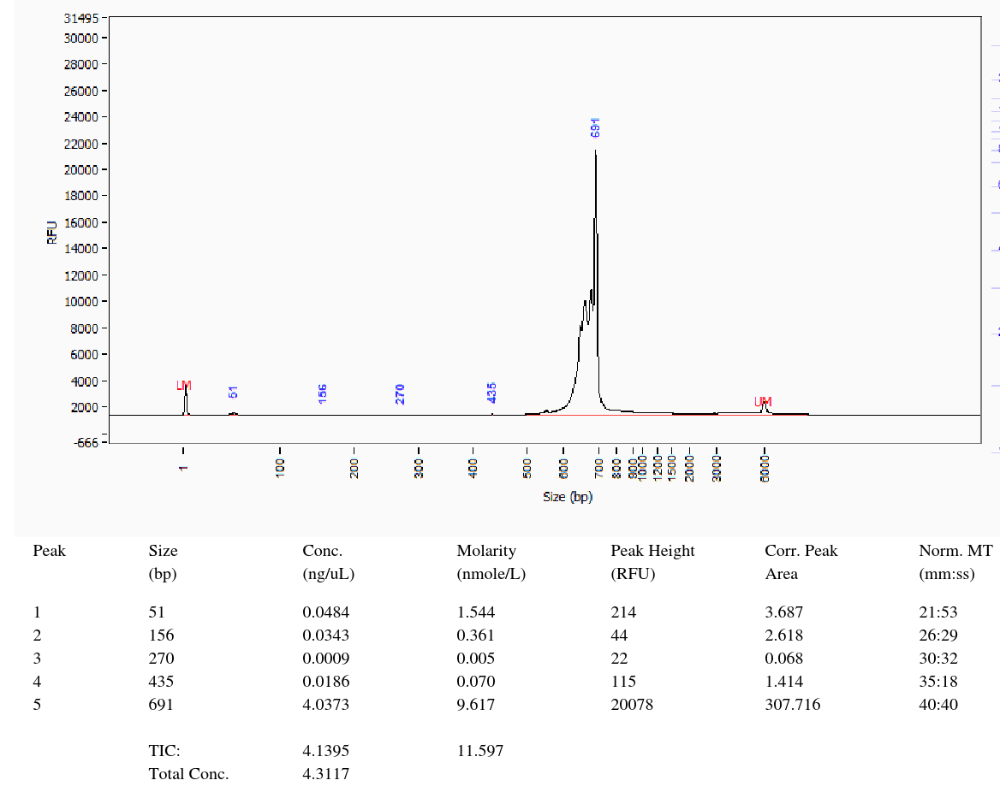

#################################
FragmentAnalsyser documentation
#################################

.. contents::

Motivation
============

Automatic reports/output from fragment analyser data sets.

Installation
================

::

    git clone https://github.com/cokelaer/FragmentAnalyser.git
    cd FragmentAnalyser
    python setup.py install 

Usage
=========

::

    fragment_analyser --pattern *csv 

.. plot::

    import fragment_analyser
    peak = fragment_analyser.PeakTableReader("test.csv")
    peak.diagnostic()

Input format
===============

Output
=============

Reference Guide
=================

.. toctree::
    :maxdepth: 2
    :numbered:

    references

